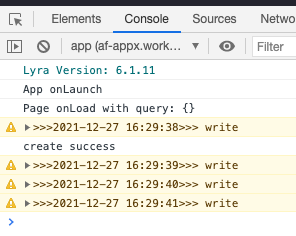

# dLog-alipay

该项目用于支付宝小程序日志本地记录，会将指定的日志保存到本地，便于用户反馈或者修复bug时参考。

由于小程序对本地存储的大小有限制，为了平衡日志数和存储大小，所以将日志内容分为三级，每一级只有一个文件

* 最新日志，最大为2M，大于2M之后备份
* 备份日志，最大为10M，大于10M之后归档
* 归档日志，备份日志大于10M之后，会用最新的归档数据覆盖老的归档数据

### 使用场景
> 
> 可以将重要数据输出，例如用户打卡记录、签到时间。当用户反馈签到无效或者错误时，连带反馈内容和日志内容一并上传到服务器，便于查看用户操作记录，毕竟有时候因为利益，有些用户比软件更会撒谎🤔
 
## 使用

### 1、引入`dLog.js`

例如将仓库中的`dLog.js`下载到本地，之后拖入项目中。`dLog.js`在项目的utils文件夹中，则可以在需要引入的地方调用

```
import dLog from '/utils/dLog'
```

### 2、打印日志

为了便于查看关键日志，该接口会使用`warn`方式打印，更加明显

```
dLog.log("write")
```
打印显示样式



### 3、读取日志

由于支付宝因为安全限制，禁止上传本地直接生成的文件。所以可以采用`POST`请求方式，将日志内容读取出来，然后上传到服务器。第一个参数分别对应上面所说的最新日志、备份日志、归档日志，可以按需读取即可

```
dLog.read(dLog.LogFilePathType.log, function(res){
    console.log(res)
})
```